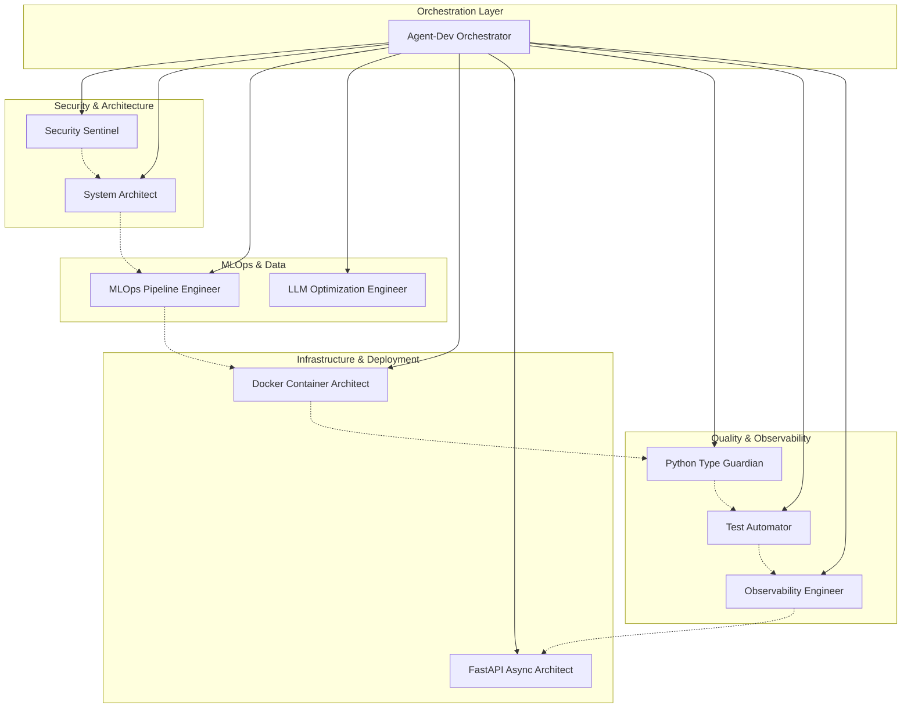

# Agent Coordination Matrix - Secure Dataset Integration

## Executive Summary

This document establishes the coordination framework for all specialized agents to work together on secure dataset download and integration while maintaining architectural integrity and security standards.

## Agent Coordination Overview



## Agent Responsibilities & Dependencies

### 🛡️ Security Sentinel
**Primary Responsibility**: Implement and validate security guardrails for dataset operations

**Current Status**: ✅ Security guardrails implemented and ready

**Dependencies**: 
- System Architect: Architecture approval for security integration
- MLOps Pipeline Engineer: Security validation of download processes

**Deliverables**:
- Security validation protocols for dataset downloads
- Threat model for dataset integration pipeline
- Security monitoring integration points

**Interfaces**:
```python
class SecurityValidation:
    def validate_dataset_source(self, source_url: str) -> SecurityCheckResult
    def scan_dataset_content(self, dataset_path: Path) -> SecurityScanResult
    def verify_download_integrity(self, checksum: str, file_path: Path) -> bool
```

### 🏗️ System Architect  
**Primary Responsibility**: Validate architectural compliance and integration patterns

**Current Status**: 🔄 Validating security integration architecture

**Dependencies**:
- Security Sentinel: Security requirements review
- MLOps Pipeline Engineer: Dataset placement and flow validation

**Deliverables**:
- Architectural compliance report
- Integration pattern recommendations
- System design validation

**Interfaces**:
```python
class ArchitecturalValidation:
    def validate_integration_pattern(self, pattern: IntegrationPattern) -> ValidationResult
    def review_data_flow_design(self, flow: DataFlow) -> ArchitecturalReview
    def approve_storage_strategy(self, strategy: StorageStrategy) -> ApprovalResult
```

### 🔧 MLOps Pipeline Engineer
**Primary Responsibility**: Execute secure dataset download with monitoring and versioning

**Current Status**: 🔄 Downloading datasets with security protection

**Dependencies**:
- Security Sentinel: Security guardrails and validation
- System Architect: Architectural guidance for dataset placement
- Docker Container Architect: Storage requirements validation

**Deliverables**:
- Securely downloaded and validated datasets
- Dataset versioning and metadata
- Training pipeline integration

**Interfaces**:
```python
class DatasetManager:
    def download_dataset_securely(self, config: DatasetConfig) -> DownloadResult
    def validate_dataset_integrity(self, dataset: Dataset) -> ValidationResult
    def integrate_with_training_pipeline(self, dataset: Dataset) -> IntegrationResult
```

### 📦 Docker Container Architect
**Primary Responsibility**: Optimize container storage for 100GB+ datasets

**Current Status**: ⏳ Awaiting storage requirements from MLOps

**Dependencies**:
- MLOps Pipeline Engineer: Storage requirements and access patterns
- Security Sentinel: Container security configurations

**Deliverables**:
- Optimized container storage strategy
- Volume management for large datasets
- Container security configurations

**Interfaces**:
```python
class ContainerStorage:
    def design_storage_volumes(self, requirements: StorageRequirements) -> VolumeConfig
    def optimize_for_large_datasets(self, size_gb: int) -> OptimizationStrategy
    def implement_security_controls(self, controls: SecurityControls) -> ContainerConfig
```

### 🐍 Python Type Guardian
**Primary Responsibility**: Create type-safe schemas for dataset operations

**Current Status**: ⏳ Awaiting dataset format specifications from MLOps

**Dependencies**:
- MLOps Pipeline Engineer: Dataset format specifications
- LLM Optimization Engineer: Training data type requirements

**Deliverables**:
- Type-safe dataset schemas
- Validation types for all dataset operations
- Mypy compliance for all new code

**Interfaces**:
```python
class DatasetTypes:
    def create_dataset_schema(self, format_spec: FormatSpec) -> Type[BaseModel]
    def validate_type_safety(self, code: str) -> TypeCheckResult
    def generate_type_stubs(self, module: str) -> TypeStubResult
```

### 👁️ Observability Engineer
**Primary Responsibility**: Implement monitoring for dataset operations and agent coordination

**Current Status**: ⏳ Awaiting security monitoring integration points

**Dependencies**:
- Security Sentinel: Security monitoring requirements
- MLOps Pipeline Engineer: Dataset operation metrics
- All Agents: Coordination monitoring requirements

**Deliverables**:
- Dataset download and validation monitoring
- Agent coordination dashboards
- Performance and security alerting

**Interfaces**:
```python
class DatasetMonitoring:
    def setup_download_metrics(self, endpoints: List[str]) -> MetricsConfig
    def create_security_alerts(self, rules: SecurityRules) -> AlertConfig
    def monitor_agent_coordination(self, agents: List[Agent]) -> CoordinationMetrics
```

### 🚀 FastAPI Async Architect
**Primary Responsibility**: Design API endpoints for dataset management

**Current Status**: ⏳ Awaiting dataset access patterns for API integration

**Dependencies**:
- MLOps Pipeline Engineer: Dataset access patterns
- Security Sentinel: API security requirements
- Python Type Guardian: API type schemas

**Deliverables**:
- Async API endpoints for dataset operations
- Performance-optimized dataset serving
- Security-compliant API design

**Interfaces**:
```python
class DatasetAPI:
    async def create_dataset_endpoints(self, patterns: AccessPatterns) -> APIConfig
    async def implement_security_middleware(self, requirements: SecurityReqs) -> Middleware
    async def optimize_for_performance(self, constraints: PerformanceConstraints) -> OptConfig
```

### 🧠 LLM Optimization Engineer
**Primary Responsibility**: Validate datasets work with training pipeline

**Current Status**: ⏳ Awaiting dataset format specifications for training integration

**Dependencies**:
- MLOps Pipeline Engineer: Dataset format specifications
- Python Type Guardian: Training data type requirements

**Deliverables**:
- Dataset-training pipeline validation
- Performance optimization recommendations
- Training integration testing

**Interfaces**:
```python
class TrainingIntegration:
    def validate_dataset_compatibility(self, dataset: Dataset) -> CompatibilityResult
    def optimize_training_performance(self, config: TrainingConfig) -> OptimizedConfig
    def test_training_pipeline(self, dataset: Dataset) -> TestResult
```

### 🧪 Test Automator
**Primary Responsibility**: Create comprehensive tests for dataset integration

**Current Status**: ⏳ Awaiting security guardrails testing requirements

**Dependencies**:
- Security Sentinel: Security testing requirements
- All Agents: Component testing specifications

**Deliverables**:
- Comprehensive test suite for dataset operations
- Integration tests for multi-agent workflows
- CI/CD test automation

**Interfaces**:
```python
class DatasetTesting:
    def create_security_tests(self, requirements: SecurityTestReqs) -> TestSuite
    def build_integration_tests(self, workflows: List[Workflow]) -> IntegrationTests
    def setup_ci_testing(self, pipeline: CIPipeline) -> TestAutomation
```

## Coordination Protocols

### 1. Synchronization Protocol

**Daily Standups**: Each agent reports status on their todo items
**Dependency Resolution**: Agents explicitly declare when they need inputs from others
**Quality Gates**: No agent proceeds to next phase without dependency satisfaction

### 2. Communication Interfaces

**Standard Message Format**:
```python
@dataclass
class AgentMessage:
    from_agent: str
    to_agent: str
    message_type: MessageType
    payload: Dict[str, Any]
    dependencies: List[str]
    timestamp: datetime
```

**Communication Channels**:
- **Blocking Dependencies**: Direct agent-to-agent coordination
- **Status Updates**: Centralized todo list updates
- **Quality Gates**: Orchestrator-managed checkpoints

### 3. Quality Gates & Success Criteria

#### Gate 1: Security Foundation ✅
- [x] Security guardrails implemented
- [x] Threat model validated
- [x] Security monitoring ready

#### Gate 2: Architecture Validation 🔄
- [ ] Storage strategy approved by System Architect
- [ ] Integration patterns validated
- [ ] Data flow design reviewed

#### Gate 3: Dataset Operations
- [ ] Secure download pipeline operational
- [ ] Type-safe schemas implemented
- [ ] Container storage optimized

#### Gate 4: Integration Testing
- [ ] All components tested independently
- [ ] Integration workflows validated
- [ ] Performance benchmarks met

#### Gate 5: Monitoring & Observability
- [ ] Full monitoring stack operational
- [ ] Security alerts configured
- [ ] Performance dashboards active

## Risk Management & Conflict Resolution

### Identified Risks

1. **Agent Bottlenecks**: MLOps pipeline blocked waiting for architecture approval
2. **Resource Conflicts**: Multiple agents needing GPU resources simultaneously  
3. **Security vs Performance**: Potential tension between security requirements and performance optimization
4. **Integration Complexity**: Risk of incompatible interfaces between agents

### Mitigation Strategies

1. **Parallel Work Streams**: Enable agents to work on non-blocking tasks while dependencies resolve
2. **Resource Scheduling**: Clear allocation of compute resources with time-boxed usage
3. **Trade-off Decision Framework**: Clear escalation path for architecture vs performance decisions
4. **Interface Contracts**: Strict adherence to defined interfaces with backwards compatibility

### Conflict Resolution Process

1. **Automated Detection**: Monitor for conflicting requirements or blocked dependencies
2. **Escalation Path**: Orchestrator → System Architect → Technical Decision
3. **Documentation**: All decisions recorded with rationale
4. **Rollback Plan**: Ability to revert decisions if they prove problematic

## Integration Testing Framework

### Test Categories

1. **Unit Tests**: Each agent's components tested independently (≥90% coverage)
2. **Integration Tests**: Agent-to-agent communication and workflows
3. **End-to-End Tests**: Complete dataset download → integration → training pipeline
4. **Security Tests**: Comprehensive security validation of entire flow
5. **Performance Tests**: Benchmarking against SLA requirements

### Automated Testing Pipeline

```yaml
# .github/workflows/agent-coordination-tests.yml
name: Agent Coordination Tests
on:
  push:
    branches: [master]
  pull_request:
    branches: [master]

jobs:
  agent-unit-tests:
    runs-on: ubuntu-latest
    strategy:
      matrix:
        agent: [security, mlops, container, type-guardian, observability, fastapi, llm, testing]
    steps:
      - uses: actions/checkout@v4
      - name: Test ${{ matrix.agent }} agent
        run: pytest tests/agents/test_${{ matrix.agent }}_agent.py -v --cov

  integration-tests:
    needs: agent-unit-tests
    runs-on: ubuntu-latest
    steps:
      - name: Test multi-agent workflows
        run: pytest tests/integration/test_agent_coordination.py -v

  e2e-tests:
    needs: integration-tests
    runs-on: ubuntu-latest
    steps:
      - name: Test complete dataset pipeline
        run: pytest tests/e2e/test_dataset_pipeline.py -v
```

## Success Metrics & KPIs

### Technical KPIs
- **Agent Coordination Latency**: < 30 seconds between agent handoffs
- **Integration Test Success Rate**: 100% pass rate on CI/CD
- **Security Validation Time**: < 5 minutes per dataset
- **Type Safety Coverage**: 100% type hints on new code
- **Test Coverage**: ≥90% across all agent components

### Business KPIs  
- **Time to Dataset Integration**: < 2 hours from download to training-ready
- **Security Incident Rate**: 0 security incidents in dataset pipeline
- **Agent Utilization**: > 80% efficiency in agent coordination
- **Pipeline Reliability**: 99.9% uptime for dataset operations

## Next Steps & Action Items

### Immediate Actions (Next 24h)
1. **Resolve Architecture Dependencies**: System Architect complete security integration review
2. **Unblock MLOps Pipeline**: Provide storage requirements to Container Architect
3. **Define Type Schemas**: Type Guardian receive dataset format specifications
4. **Setup Monitoring**: Observability Engineer integrate with security monitoring

### Short Term (1-3 days)
1. **Complete Integration Testing**: All agents implement and test their interfaces
2. **Validate Performance**: Benchmark full pipeline against SLA requirements
3. **Security Validation**: Complete end-to-end security testing
4. **Documentation**: Finalize all integration guides and runbooks

### Medium Term (1-2 weeks)
1. **Production Deployment**: Roll out coordinated dataset pipeline to production
2. **Monitor & Optimize**: Collect performance metrics and optimize bottlenecks
3. **Knowledge Transfer**: Document lessons learned and best practices
4. **Future Planning**: Plan next iteration of agent coordination improvements

This coordination matrix ensures all agents work together effectively while maintaining our architectural integrity and security standards. The framework provides clear interfaces, quality gates, and success criteria for seamless collaboration.