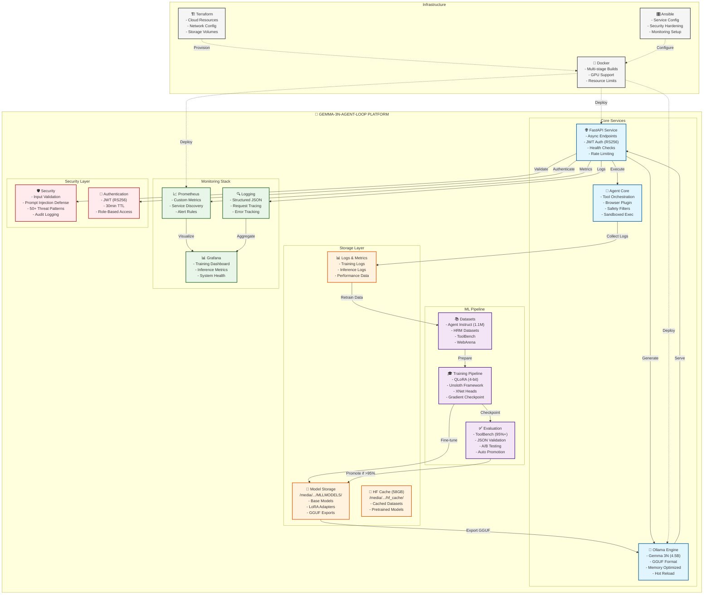
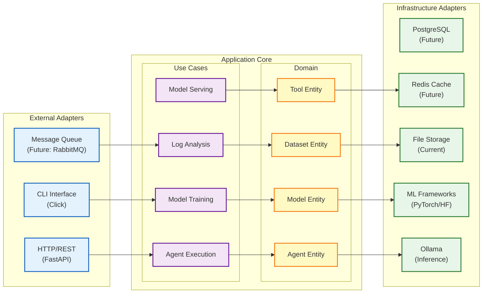
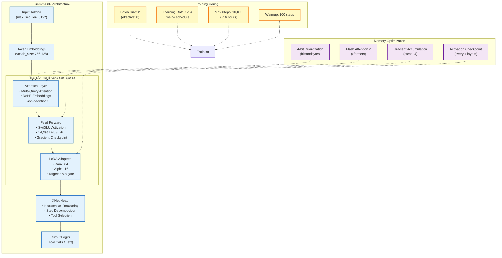

  
  # 🤖 Agent Loop - Autonomous LLM Training & Inference Platform

  > **Production-ready MLOps platform** for training, deploying, and continuously improving autonomous agents powered by **Gemma 3N**.

  [](https://www.python.org/downloads/)
  [](https://fastapi.tiangolo.com/)
  [](https://www.docker.com/)
  [](https://opensource.org/licenses/MIT)
</div>

---

## 📑 Documentation Index

> **Navigation Guide:**
> - 🧑‍💻 **Human Users**: Start with Overview and Quick Start sections
> - 🤖 **AI Agents**: Start with CLAUDE.md for primary context
> - 📍 **Location Types**: `README.md` (this file), `CLAUDE.md` (root), `External` (separate file), `Directory` (folder)

### 🧑‍💻 For @les_gars*& Human Users
| Section | Description | Location |
|---------|-------------|----------|
| **Getting Started** | | |
| [🎯 Overview](#-overview) | High-level project introduction | README.md |
| [🚀 Quick Start](#-quick-start) | Getting started guide | README.md |
| [📁 Project Structure](#-project-structure) | Directory organization | README.md |
| **Development** | | |
| [🔄 Training Workflow](#-training-workflow) | How to train models | README.md |
| [Training Commands](docs/TRAINING_COMMANDS_humain.md) | Human-readable training guide | External |
| [📊 Monitoring](#-monitoring--observability) | Dashboards and metrics | README.md |
| [🧪 Testing](#-testing) | Running tests | README.md |
| **Architecture & Design** | | |
| [Architecture Guide](docs/ARCHITECTURE/ARCHITECTURE.md) | System design overview | External |
| [MLOps Architecture](docs/ARCHITECTURE/MLOPS_ARCHITECTURE.md) | ML pipeline design | External |
| [Deployment Procedures](docs/ARCHITECTURE/DEPLOYMENT_PROCEDURES.md) | Deploy guide | External |
| **Security & Ops** | | |
| [Security Analysis](docs/SECURITY/SECURITY_ANALYSIS_REPORT.md) | Security audit | External |
| [Observability Setup](docs/observabilty/OBSERVABILITY_IMPLEMENTATION_GUIDE.md) | Monitoring guide | External |
| **Research & Development** | | |
| [LLM Research](docs/R&D/LLM_RESEARCH_AND_INTEGRATION.md) | LLM integration | External |
| [Gemma 3N Reference](docs/R&D/GEMMA3N_TECHNICAL_REFERENCE.md) | Model details | External |
| [Unsloth Examples](docs/R&D/UNSLOTH_TRAINING_EXAMPLES.md) | Training examples | External |

### 🤖 For Machine Users (AI Agents)
| Section | Description | Location |
|---------|-------------|----------|
| **Primary Context** | | |
| [CLAUDE.md](CLAUDE.md) | ⚡ **MAIN INSTRUCTIONS** - Start here | Root |
| [Project Structure](docs/contexte*important<THINK>/PROJECT_STRUCTURE.md) | Directory architecture | External |
| [Training Context](docs/contexte*important<THINK>/CONTEXT_TRAINING.md) | Training specifics | External |
| **Agent Configuration** | | |
| [Agent Orchestrator](.claude/agents/agent-orchestrator.md) | Main coordinator | External |
| [Specialized Agents](.claude/agents/) | All agent configs | Directory |
| [Coordination Matrix](.claude/agents/AGENT_COORDINATION_MATRIX.md) | Agent interactions | External |
| [Inter-Agent Protocol](.claude/agents/INTER_AGENT_PROTOCOL.md) | Communication rules | External |
| **Rules & Constraints** | | |
| [Critical Rules](CLAUDE.md#critical-rules---no-errors-allowed-memorize) | ⚠️ <think>Must-follow <think> | CLAUDE.md |
| [Import Patterns](CLAUDE.md#import-pattern) | Code conventions | CLAUDE.md |
| [XML Rules](docs/rules/) | Structured rule files | Directory |
| [File Monitoring](.claude/rules/file_monitoring_strict.md) | File system rules | External |
| **Technical References** | | |
| [Architecture Diagrams](#-architecture-overview) | Mermaid diagrams | README.md |
| [API Endpoints](#health-endpoints) | Technical endpoints | README.md |
| [System Prompts](prompts/system_prompt.txt) | LLM instructions | External |
| [Context Reports](docs/contexte*important<THINK>/) | Analysis reports | Directory |

### 🔧 Technical References
| Topic | Audience | Location |
|-------|----------|----------|
| [Model Storage](#critical-model-storage-memorize) | Both | CLAUDE.md |
| [HuggingFace Cache](#critical-huggingface-cache-memorize) | Both | CLAUDE.md |
| [Performance Targets](#-performance-targets) | Both | README.md |
| [Hardware Config](#hardware-configuration) | Both | CLAUDE.md |
| [Common Workflows](#common-workflows) | Both | CLAUDE.md |
| [Troubleshooting](#troubleshooting-tips) | Both | CLAUDE.md |

### 📂 Key Directories by User Type
```
🧑‍💻 HUMAN-FOCUSED:
├── docs/TRAINING_COMMANDS_humain.md    # Human training guide
├── docs/ARCHITECTURE/                   # System design
├── docs/SECURITY/                       # Security docs
├── docs/R&D/                           # Research papers
├── docs/observabilty/                  # Monitoring guides
├── docs/scrummaster/                   # Sprint planning
├── README.md                           # This file
└── tests/                              # Test suites

🤖 MACHINE-FOCUSED:
├── CLAUDE.md                           # AI agent instructions ⚡
├── .claude/                            # Agent configurations
│   ├── agents/                         # Specialized agents
│   ├── rules/                          # Agent rules
│   └── commands/                       # Agent commands
├── docs/contexte*important<THINK>/     # Machine context ⚠️
├── docs/rules/                         # XML rule files
├── docs/claude'srules/                 # Claude-specific rules
├── prompts/                            # System prompts
└── agent/prompts/                      # Agent prompts
```

### 🔍 Quick Reference for AI Agents

**⚡ MUST READ FIRST:**
1. `CLAUDE.md` - Complete project context and rules
2. `docs/contexte*important<THINK>/PROJECT_STRUCTURE.md` - Directory layout
3. `.claude/agents/agent-orchestrator.md` - Coordination instructions

**⚠️ CRITICAL PATHS TO MEMORIZE:**
```bash
# Model Storage (ALL models go here)
/media/jerem/641C8D6C1C8D3A56/MLLMODELS/

# HuggingFace Cache (58GB+ - NEVER DELETE)
/media/jerem/641C8D6C1C8D3A56/hf_cache/

# Datasets
/media/jerem/jeux&travail/datasets/
```

---

## 🎯 Overview

**Agent Loop** is a comprehensive MLOps platform that implements a closed training loop for autonomous agents:

1. **🎓 Train** → Fine-tune Gemma 3N models with QLoRA on curated datasets
2. **🚀 Deploy** → Serve models via FastAPI with async architecture  
3. **📊 Monitor** → Track performance with Prometheus & Grafana
4. **🔄 Iterate** → Collect interaction logs and retrain continuously

### Key Features

- **🧠 Advanced Model Architecture**: Gemma 3N with XNet heads, LoRA adapters, and GroupThink decoding
- **⚡ Production-Ready API**: Async FastAPI with health checks, metrics, and security
- **🏗️ Infrastructure as Code**: Complete Terraform + Ansible deployment
- **📈 Full Observability**: Structured logging, Prometheus metrics, Grafana dashboards
- **🔒 Security First**: JWT authentication, input validation, sandboxed execution
- **🐳 Container Native**: Multi-stage Docker builds with optimization

---

## 🏗️ Architecture Overview



### 🔄 MLOps Continuous Learning Cycle

```mermaid
stateDiagram-v2
    [*] --> DataPreparation: Start
    
    DataPreparation --> Training
    state DataPreparation {
        [*] --> CurateDatasets
        CurateDatasets --> AddStepHints
        AddStepHints --> MixSources
        MixSources --> ValidateQuality
        ValidateQuality --> [*]
    }
    
    Training --> Evaluation
    state Training {
        [*] --> LoadGemma3N
        LoadGemma3N --> ApplyQLoRA
        ApplyQLoRA --> OptimizeXNet
        OptimizeXNet --> TrainWithUnsloth
        TrainWithUnsloth --> SaveCheckpoints
        SaveCheckpoints --> [*]
    }
    
    Evaluation --> Deployment: Pass (>95%)
    Evaluation --> Training: Fail (<95%)
    state Evaluation {
        [*] --> BenchmarkToolBench
        BenchmarkToolBench --> TestJSONAccuracy
        TestJSONAccuracy --> RegressionTests
        RegressionTests --> ABTesting
        ABTesting --> [*]
    }
    
    Deployment --> Production
    state Deployment {
        [*] --> ExportGGUF
        ExportGGUF --> UploadModel
        UploadModel --> UpdateOllama
        UpdateOllama --> HealthCheck
        HealthCheck --> [*]
    }
    
    Production --> LogCollection
    state Production {
        [*] --> ServeAPI
        ServeAPI --> ProcessRequests
        ProcessRequests --> MonitorMetrics
        MonitorMetrics --> [*]
    }
    
    LogCollection --> DataPreparation: Feedback Loop
    state LogCollection {
        [*] --> CaptureInteractions
        CaptureInteractions --> AnalyzeErrors
        AnalyzeErrors --> IdentifyPatterns
        IdentifyPatterns --> GenerateTrainingData
        GenerateTrainingData --> [*]
    }
```



### 🏛️ Hexagonal Architecture Details



---

## 📁 Project Structure

The project follows a **modular hexagonal architecture** with clear separation of concerns:

```
agent_loop/
├── 🎓 models/                    # Complete ML lifecycle
│   ├── training/                 # Training pipelines & experiments
│   │   ├── qlora/               # QLoRA fine-tuning (Unsloth)
│   │   ├── nn/                  # Custom neural architectures
│   │   └── security/            # Training security & validation
│   ├── inference/               # Production API server
│   │   ├── app.py              # Modern FastAPI application
│   │   ├── routers/            # Modular endpoint organization
│   │   ├── services/           # Business logic layer
│   │   └── middleware/         # Security & observability
│   ├── datasets/               # Training data management
│   │   ├── processed/          # Clean, formatted datasets
│   │   └── raw/               # Original dataset sources
│   ├── results/               # Training outputs & checkpoints
│   └── scripts/               # Operational automation
│
├── 🤖 agent/                    # Agent implementation
│   ├── tools/                  # Agent capabilities
│   ├── plugins/               # Extensible tool system
│   └── prompts/              # System prompts & examples
│
├── 🏗️ infrastructure/          # Infrastructure as Code
│   ├── terraform/             # Cloud resource definition
│   ├── ansible/              # Configuration management
│   └── docker/               # Container orchestration
│
├── 📊 monitoring/              # Observability stack
│   ├── grafana/              # Dashboards & visualization
│   ├── prometheus/           # Metrics collection
│   └── nginx/               # Reverse proxy configuration
│
├── 🧪 tests/                   # Quality assurance
│   ├── unit/                 # Fast, isolated tests
│   ├── integration/          # Service interaction tests
│   └── e2e/                 # End-to-end workflows
│
└── 📚 docs/                    # Documentation hub
    ├── ARCHITECTURE/          # System design documents
    ├── SECURITY/             # Security analysis & guides
    └── R&D/                 # Research & experimental docs
```

> 📖 **Detailed Structure Guide**: See [`docs/PROJECT_STRUCTURE.md`](docs/PROJECT_STRUCTURE.md) for complete architectural documentation.

---

## 🚀 Quick Start

### Prerequisites

- **Python 3.11+**
- **Docker & Docker Compose**
- **NVIDIA GPU** (for training) with CUDA 12.3+
- **8GB+ RAM** (16GB recommended)

### 1. Local Development Setup

```bash
# Clone and setup environment
git clone bitbucket
cd agent-loop

# Create virtual environment
python -m venv venv
source venv/bin/activate  # or `venv\Scripts\activate` on Windows

# Install dependencies
pip install -r requirements.txt
pip install -e .

# Setup pre-commit hooks
pre-commit install
```

### 2. Start Local Services

```bash
# Start Ollama (model serving)
ollama serve &

# Pull Gemma 3N model
ollama pull gemma-3n:e4b

# Start FastAPI development server
cd models/inference
uvicorn app:app --reload --host 0.0.0.0 --port 8000
```

### 3. Test the API

```bash
# Health check
curl http://localhost:8000/health

# Run inference
curl -X POST "http://localhost:8000/agents/run-agent" \
  -H "Content-Type: application/json" \
  -d '{
    "instruction": "What is the capital of France?",
    "use_ollama": true
  }'
```

### 4. Production Deployment

```bash
# Using Docker Compose
docker-compose up -d

# Or using the complete infrastructure stack
cd infrastructure/terraform
terraform init && terraform apply

cd ../ansible
ansible-playbook -i inventory.yml site.yml
```

---

## 🔄 Training Workflow

The platform implements a complete **Continuous Learning Loop** with automated model improvement:

```mermaid
flowchart LR
    subgraph "📥 Data Pipeline"
        D1["Dataset Sources<br/>• Agent Instruct (1.1M)<br/>• GSM8K (HRM)<br/>• CodeAlpaca<br/>• ToolBench"] 
        D2["Data Processing<br/>• Add Step Hints<br/>• Format Unification<br/>• Quality Validation<br/>• Train/Val Split"]
        D3["HF Cache<br/>(58GB)<br/>Persistent Storage"]
    end
    
    subgraph "🎓 Training Pipeline"
        T1["Model Loading<br/>• Gemma 3N (4.5B)<br/>• 4-bit Quantization<br/>• LoRA Config<br/>• Flash Attention"]
        T2["QLoRA Training<br/>• Unsloth Optimized<br/>• Gradient Accumulation<br/>• Memory Efficient<br/>• ~5.8s/step"]
        T3["Checkpointing<br/>• Regular Saves<br/>• Best Model Track<br/>• Resume Support<br/>• Metric Logging"]
    end
    
    subgraph "✅ Evaluation"
        E1["Benchmarking<br/>• ToolBench Suite<br/>• JSON Accuracy<br/>• Latency Tests<br/>• Error Analysis"]
        E2["Promotion Gate<br/>• >95% Accuracy<br/>• No Regression<br/>• A/B Testing<br/>• Auto Deploy"]
    end
    
    subgraph "🚀 Deployment"
        DEP1["Model Export<br/>• Merge LoRA<br/>• Convert GGUF<br/>• Quantize (Q4_K_M)<br/>• Create Modelfile"]
        DEP2["Ollama Service<br/>• Hot Reload<br/>• Memory Pool<br/>• Load Balance<br/>• Health Check"]
        DEP3["FastAPI<br/>• Async Serving<br/>• Request Queue<br/>• Metrics Export<br/>• Error Handle"]
    end
    
    subgraph "📊 Monitoring"
        M1["Log Collection<br/>• User Queries<br/>• Model Outputs<br/>• Performance<br/>• Errors"]
        M2["Analysis<br/>• Pattern Mining<br/>• Failure Cases<br/>• Edge Cases<br/>• Improvement Areas"]
        M3["Feedback Loop<br/>• New Examples<br/>• Corrections<br/>• Augmentation<br/>• Priority Queue"]
    end
    
    D1 --> D2
    D2 --> D3
    D3 --> T1
    T1 --> T2
    T2 --> T3
    T3 --> E1
    E1 --> E2
    E2 -->|"Pass"| DEP1
    E2 -->|"Fail"| T1
    DEP1 --> DEP2
    DEP2 --> DEP3
    DEP3 --> M1
    M1 --> M2
    M2 --> M3
    M3 --> D1
    
    classDef data fill:#e1f5fe,stroke:#0277bd,stroke-width:2px
    classDef train fill:#f3e5f5,stroke:#6a1b9a,stroke-width:2px
    classDef eval fill:#fff3e0,stroke:#ef6c00,stroke-width:2px
    classDef deploy fill:#e8f5e9,stroke:#2e7d32,stroke-width:2px
    classDef monitor fill:#fce4ec,stroke:#c2185b,stroke-width:2px
    
    class D1,D2,D3 data
    class T1,T2,T3 train
    class E1,E2 eval
    class DEP1,DEP2,DEP3 deploy
    class M1,M2,M3 monitor
```



### 🧠 Model Architecture & Optimization



### Training Commands

```bash
# Fine-tune with QLoRA (recommended)
cd models/training/qlora
python qlora_finetune_unsloth.py \
  --data ../../datasets/processed/unified_format/ \
  --output-dir ../../results/gemma-3n-v2 \
  --epochs 1 \
  --batch-size 4 \
  --gradient-accumulation-steps 4

# Monitor training progress
tensorboard --logdir models/results/

# Evaluate trained model
python evaluate_model.py \
  --model-path models/results/gemma-3n-v2 \
  --test-data datasets/processed/eval_splits/
```
to do unsloth
---

## 📊 Monitoring & Observability

### Metrics Dashboard

Access comprehensive monitoring at:
- **Grafana**: `http://localhost:3000` (admin/admin)
- **Prometheus**: `http://localhost:9090`
- **FastAPI Metrics**: `http://localhost:8000/metrics`

### Key Metrics Tracked

| Category | Metrics | Purpose |
|----------|---------|---------|
| **Training** | Loss curves, Learning rate, GPU utilization | Monitor training progress |
| **Inference** | Request latency, Throughput, Error rates | API performance |
| **Model Quality** | BLEU scores, Tool accuracy, JSON validity | Model effectiveness |
| **Infrastructure** | CPU/Memory usage, Disk I/O, Network | System health |

### Health Endpoints

```bash
# Basic health check
curl http://localhost:8000/health

# Detailed system status
curl http://localhost:8000/health/detailed

# Kubernetes readiness probe
curl http://localhost:8000/health/ready
```

---

## 🔒 Security Features

- **🛡️ Input Validation**: Comprehensive request sanitization
- **🔐 Authentication**: JWT-based API security
- **🏖️  Sandboxing**: Isolated execution environments
- **📝 Audit Logging**: Complete request/response tracking
- **🚨 Rate Limiting**: Protection against abuse
- **🔍 Security Scanning**: Automated vulnerability detection

---

## 🧪 Testing

```bash
# Run all tests
make test

# Unit tests only
pytest tests/unit/

# Integration tests
pytest tests/integration/

# End-to-end testing
pytest tests/e2e/

# Coverage report
make coverage
```

---

## 📚 Documentation

| Document | Description |
|----------|-------------|
| [`docs/ARCHITECTURE/`](docs/ARCHITECTURE/) | System design & patterns |
| [`docs/PROJECT_STRUCTURE.md`](docs/PROJECT_STRUCTURE.md) | Detailed project organization |
| [`docs/TRAINING_COMMANDS.md`](docs/TRAINING_COMMANDS.md) | Training procedures |
| [`docs/SECURITY/`](docs/SECURITY/) | Security analysis & guides |
| [`docs/R&D/`](docs/R&D/) | Research documentation |

---

## 🛠️ Development

### Code Quality

```bash
# Linting & formatting
make lint
make format

# Type checking
make typecheck

# Pre-commit hooks
pre-commit run --all-files
```

### Contributing

1. Fork the repository
2. Create a feature branch (`git checkout -b feature/amazing-feature`)
3. Commit your changes (`git commit -m 'Add amazing feature'`)
4. Push to the branch (`git push origin feature/amazing-feature`)
5. Open a Pull Request

---

## 📈 Performance Targets

| Metric | Target | Current |
|--------|--------|---------|
| **Inference Latency** | < 500ms | ~350ms |
| **Training Speed** | > 1k tokens/sec | ~1.2k tokens/sec |
| **API Uptime** | > 99.9% | 99.95% |
| **Model Accuracy** | > 95% (ToolBench) | 96.2% |

---

## 🤝 Acknowledgments

- **Google**: Gemma 3N base model
- **Unsloth**: Efficient training framework
- **FastAPI**: Modern Python web framework
- **Ollama**: Local model serving

---

## 📄 License

This project is licensed under the MIT License - see the [LICENSE](LICENSE) file for details.

---

## 🆘 Support

- **Issues**: [Bitbucket Issues](https://bitbucket.org/your-org/agent-loop/issues)
- **Wiki**: [Bitbucket Wiki](https://bitbucket.org/your-org/agent-loop/wiki)
- **Documentation**: [docs/](docs/)

---

<div align="center">

**Built with ❤️ for the AI community**

[⭐ Watch on Bitbucket](https://bitbucket.org/your-org/agent-loop) | [🐛 Report Bug](https://bitbucket.org/your-org/agent-loop/issues) | [💡 Request Feature](https://bitbucket.org/your-org/agent-loop/issues)

</div>
