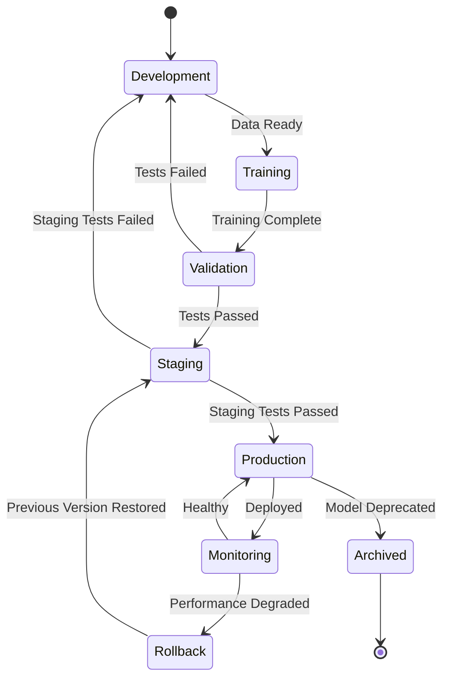

# 🏗️ Architecture MLOps - Agent Loop Pipeline

## Vue d'ensemble

Cette architecture MLOps implémente un pipeline de bout en bout pour le développement, l'entraînement, le déploiement et la surveillance de modèles d'IA. Elle est conçue pour gérer le cycle de vie complet des modèles avec des pratiques DevOps modernes.

## 🎯 Objectifs Architecturaux

- **Reproductibilité** : Chaque étape est versionnable et reproductible
- **Observabilité** : Monitoring complet de la performance des modèles
- **Scalabilité** : Architecture capable de gérer plusieurs modèles simultanés  
- **Fiabilité** : Déploiements sécurisés avec rollback automatique
- **Collaboration** : Processus GitOps avec révision de code

## 📊 Diagramme d'Architecture

```
┌─────────────────────────────────────────────────────────────────────────────┐
│                          MLOps Pipeline Architecture                        │
├─────────────────────────────────────────────────────────────────────────────┤
│                                                                             │
│  ┌─────────────┐    ┌─────────────┐    ┌─────────────┐    ┌─────────────┐  │
│  │   DATA      │    │  TRAINING   │    │ VALIDATION  │    │ DEPLOYMENT  │  │
│  │ INGESTION   │───▶│  PIPELINE   │───▶│   & TEST    │───▶│  PIPELINE   │  │
│  └─────────────┘    └─────────────┘    └─────────────┘    └─────────────┘  │
│         │                   │                   │                   │       │
│         ▼                   ▼                   ▼                   ▼       │
│  ┌─────────────┐    ┌─────────────┐    ┌─────────────┐    ┌─────────────┐  │
│  │ Data Store  │    │Model Registry│    │Test Reports │    │  Production │  │
│  │ (S3/MinIO)  │    │  (MLflow)   │    │ (Artifacts) │    │ Environment │  │
│  └─────────────┘    └─────────────┘    └─────────────┘    └─────────────┘  │
│                                                                             │
├─────────────────────────────────────────────────────────────────────────────┤
│                          MONITORING & OBSERVABILITY                        │
├─────────────────────────────────────────────────────────────────────────────┤
│                                                                             │
│  ┌─────────────┐    ┌─────────────┐    ┌─────────────┐    ┌─────────────┐  │
│  │ Prometheus  │    │   Grafana   │    │ AlertManager│    │   Jaeger    │  │
│  │ (Metrics)   │───▶│(Dashboards) │───▶│  (Alerts)   │    │ (Tracing)   │  │
│  └─────────────┘    └─────────────┘    └─────────────┘    └─────────────┘  │
│         ▲                                       │                   ▲       │
│         │                                       ▼                   │       │
│  ┌─────────────────────────────────────────────────────────────────────┐   │
│  │                   Model Performance Monitoring                     │   │
│  │  • Input/Output Drift Detection  • Latency Tracking               │   │
│  │  • Accuracy Regression Tests     • Resource Utilization           │   │
│  │  • Business Metric Correlation   • Error Rate Analysis            │   │
│  └─────────────────────────────────────────────────────────────────────┘   │
│                                                                             │
└─────────────────────────────────────────────────────────────────────────────┘
```

## 🔄 Pipeline de Développement MLOps

### Phase 1: Ingestion des Données

```python
# Exemple de pipeline de données
class DataIngestionPipeline:
    """
    Pipeline d'ingestion des données avec validation et versioning.
    
    Features:
    - Validation de schéma automatique
    - Détection d'anomalies dans les données
    - Versioning des datasets avec DVC
    - Lineage tracking complet
    """
    
    def __init__(self, source_config: DataSourceConfig):
        self.source_config = source_config
        self.validator = DataValidator()
        self.profiler = DataProfiler()
        
    async def ingest_batch(self, batch_id: str) -> DataBatch:
        """Ingère un batch de données avec validation complète."""
        
        # 1. Extraction des données sources
        raw_data = await self.extract_from_source()
        
        # 2. Validation de qualité
        validation_result = self.validator.validate(raw_data)
        if not validation_result.is_valid:
            raise DataQualityError(validation_result.errors)
            
        # 3. Profilage et statistiques
        profile = self.profiler.profile(raw_data)
        
        # 4. Transformation et nettoyage
        clean_data = self.transform(raw_data)
        
        # 5. Versioning et stockage
        version = await self.version_and_store(clean_data, batch_id)
        
        return DataBatch(
            id=batch_id,
            version=version,
            profile=profile,
            validation=validation_result
        )
```

### Phase 2: Entraînement et Expérimentation

```python
class ModelTrainingPipeline:
    """
    Pipeline d'entraînement avec tracking d'expériences et optimisation.
    
    Intègre:
    - Hyperparameter tuning avec Optuna
    - Distributed training avec PyTorch
    - Experiment tracking avec MLflow
    - Model versioning automatique
    """
    
    def __init__(self, config: TrainingConfig):
        self.config = config
        self.experiment_tracker = MLflowTracker()
        self.model_registry = ModelRegistry()
        
    async def train_model(self, experiment_name: str) -> TrainingResult:
        """Entraîne un modèle avec tracking complet."""
        
        with self.experiment_tracker.start_run(experiment_name) as run:
            # 1. Chargement des données
            train_data, val_data = await self.load_training_data()
            
            # 2. Preprocessing et feature engineering
            features = self.feature_pipeline.transform(train_data)
            
            # 3. Entraînement avec checkpointing
            model = await self.train_with_checkpoints(features, val_data)
            
            # 4. Évaluation sur test set
            metrics = await self.evaluate_model(model, self.test_data)
            
            # 5. Logging des artifacts
            self.log_artifacts(model, metrics, run.info.run_id)
            
            # 6. Enregistrement dans le registry
            model_version = await self.model_registry.register_model(
                model, metrics, experiment_name
            )
            
            return TrainingResult(
                model_version=model_version,
                metrics=metrics,
                run_id=run.info.run_id
            )
```

### Phase 3: Validation et Tests

```python
class ModelValidationPipeline:
    """
    Pipeline de validation complète avant déploiement.
    
    Tests:
    - Performance metrics (accuracy, latency, throughput)
    - Fairness et bias detection
    - Robustness testing (adversarial attacks)
    - Integration tests avec API
    """
    
    async def validate_model(self, model_version: str) -> ValidationReport:
        """Validation complète d'un modèle avant déploiement."""
        
        model = await self.model_registry.load_model(model_version)
        
        results = {}
        
        # 1. Tests de performance
        results['performance'] = await self.performance_tests(model)
        
        # 2. Tests de robustesse
        results['robustness'] = await self.robustness_tests(model)
        
        # 3. Tests de biais et équité
        results['fairness'] = await self.fairness_tests(model)
        
        # 4. Tests d'intégration
        results['integration'] = await self.integration_tests(model)
        
        # 5. Tests de dérive de données
        results['data_drift'] = await self.data_drift_tests(model)
        
        # 6. Décision de déploiement
        deployment_decision = self.make_deployment_decision(results)
        
        return ValidationReport(
            model_version=model_version,
            test_results=results,
            deployment_approved=deployment_decision.approved,
            recommendations=deployment_decision.recommendations
        )
```

### Phase 4: Déploiement Blue-Green

```python
class BlueGreenDeployment:
    """
    Déploiement Blue-Green avec tests de fumée et rollback automatique.
    
    Process:
    1. Déploiement en environnement Green (staging)
    2. Tests de fumée et validation
    3. Basculement progressif du trafic
    4. Monitoring continu et rollback si nécessaire
    """
    
    async def deploy_model(self, model_version: str) -> DeploymentResult:
        """Déploie un modèle avec stratégie Blue-Green."""
        
        try:
            # 1. Déploiement Green
            green_deployment = await self.deploy_to_green(model_version)
            
            # 2. Tests de fumée
            smoke_test_result = await self.run_smoke_tests(green_deployment)
            if not smoke_test_result.passed:
                raise DeploymentError("Smoke tests failed")
                
            # 3. Basculement progressif (Canary)
            await self.canary_rollout(green_deployment, traffic_percentage=10)
            
            # 4. Monitoring des métriques
            metrics = await self.monitor_deployment(green_deployment, duration=300)
            
            # 5. Validation des métriques
            if not self.validate_deployment_metrics(metrics):
                await self.rollback_deployment()
                raise DeploymentError("Performance degradation detected")
                
            # 6. Basculement complet
            await self.complete_rollout(green_deployment)
            
            return DeploymentResult(
                model_version=model_version,
                deployment_id=green_deployment.id,
                status="success",
                metrics=metrics
            )
            
        except Exception as e:
            await self.rollback_deployment()
            raise e
```

## 📈 Monitoring et Observabilité

### Architecture de Monitoring

```yaml
# Configuration Prometheus pour MLOps
monitoring_stack:
  prometheus:
    scrape_configs:
      - job_name: 'model-inference'
        static_configs:
          - targets: ['fastapi:8000']
        metrics_path: '/metrics'
        scrape_interval: 15s
        
      - job_name: 'ollama-service'
        static_configs:
          - targets: ['ollama:11434']
        scrape_interval: 30s
        
    rule_files:
      - "/etc/prometheus/rules/model_alerts.yml"
      - "/etc/prometheus/rules/performance_alerts.yml"
      
  grafana:
    dashboards:
      - model_performance_dashboard.json
      - system_health_dashboard.json
      - business_metrics_dashboard.json
      
    alerts:
      - name: "Model Drift Alert"
        condition: "drift_score > 0.1"
        severity: "warning"
        
      - name: "High Inference Latency"
        condition: "inference_duration_p95 > 5s"
        severity: "critical"
```

### Métriques Clés MLOps

```python
# Métriques personnalisées pour MLOps
from prometheus_client import Counter, Histogram, Gauge

# Métriques d'inférence
INFERENCE_REQUESTS = Counter(
    'model_inference_requests_total',
    'Total number of inference requests',
    ['model_version', 'endpoint', 'status']
)

INFERENCE_DURATION = Histogram(
    'model_inference_duration_seconds',
    'Time spent on model inference',
    ['model_version', 'endpoint'],
    buckets=[0.1, 0.5, 1.0, 2.0, 5.0, 10.0, 30.0]
)

# Métriques de qualité du modèle
MODEL_DRIFT_SCORE = Gauge(
    'model_drift_score',
    'Current model drift score',
    ['model_version', 'drift_type']
)

MODEL_ACCURACY = Gauge(
    'model_accuracy',
    'Current model accuracy',
    ['model_version', 'dataset']
)

# Métriques business
BUSINESS_VALUE = Counter(
    'business_value_generated',
    'Business value generated by model',
    ['model_version', 'use_case', 'value_type']
)
```

## 🔧 Infrastructure as Code

### Configuration Terraform

```hcl
# infrastructure/terraform/mlops.tf
resource "aws_eks_cluster" "mlops_cluster" {
  name     = "agent-loop-mlops"
  role_arn = aws_iam_role.cluster_role.arn
  version  = "1.28"

  vpc_config {
    subnet_ids = [
      aws_subnet.private_subnet_1.id,
      aws_subnet.private_subnet_2.id
    ]
    endpoint_private_access = true
    endpoint_public_access  = true
  }

  enabled_cluster_log_types = [
    "api", "audit", "authenticator", "controllerManager", "scheduler"
  ]

  tags = {
    Name        = "MLOps Cluster"
    Environment = var.environment
    Project     = "agent-loop"
  }
}

# Node group pour workloads ML
resource "aws_eks_node_group" "ml_workers" {
  cluster_name    = aws_eks_cluster.mlops_cluster.name
  node_group_name = "ml-workers"
  node_role_arn   = aws_iam_role.node_role.arn
  subnet_ids      = [aws_subnet.private_subnet_1.id, aws_subnet.private_subnet_2.id]
  
  instance_types = ["g4dn.xlarge"]  # GPU instances for training
  
  scaling_config {
    desired_size = 2
    max_size     = 10
    min_size     = 1
  }

  tags = {
    "k8s.io/cluster-autoscaler/enabled" = "true"
    "k8s.io/cluster-autoscaler/agent-loop-mlops" = "owned"
  }
}

# S3 bucket pour artifacts ML
resource "aws_s3_bucket" "ml_artifacts" {
  bucket = "agent-loop-ml-artifacts-${random_id.bucket_suffix.hex}"
  
  tags = {
    Name        = "ML Artifacts"
    Environment = var.environment
  }
}

resource "aws_s3_bucket_versioning" "ml_artifacts_versioning" {
  bucket = aws_s3_bucket.ml_artifacts.id
  versioning_configuration {
    status = "Enabled"
  }
}
```

### Playbooks Ansible pour MLOps

```yaml
# ansible/playbooks/mlops-setup.yml
---
- name: Setup MLOps Infrastructure
  hosts: mlops_nodes
  become: true
  vars:
    mlflow_version: "2.8.1"
    kubeflow_version: "1.7.0"
    
  tasks:
    - name: Install MLflow tracking server
      pip:
        name: "mlflow=={{ mlflow_version }}"
        state: present
        
    - name: Configure MLflow tracking server
      template:
        src: mlflow_config.j2
        dest: /etc/mlflow/mlflow.conf
      notify: restart mlflow
      
    - name: Setup model registry database
      postgresql_db:
        name: mlflow_registry
        state: present
        
    - name: Configure Kubeflow Pipelines
      kubernetes.core.k8s:
        name: kubeflow-pipelines
        api_version: v1
        kind: Namespace
        state: present
        
    - name: Deploy MLflow tracking server
      kubernetes.core.k8s:
        definition:
          apiVersion: apps/v1
          kind: Deployment
          metadata:
            name: mlflow-tracking
            namespace: mlops
          spec:
            replicas: 2
            selector:
              matchLabels:
                app: mlflow-tracking
            template:
              metadata:
                labels:
                  app: mlflow-tracking
              spec:
                containers:
                - name: mlflow
                  image: "mlflow/mlflow:{{ mlflow_version }}"
                  ports:
                  - containerPort: 5000
                  env:
                  - name: BACKEND_STORE_URI
                    value: "postgresql://mlflow:{{ mlflow_db_password }}@postgres:5432/mlflow_registry"
                  - name: DEFAULT_ARTIFACT_ROOT
                    value: "s3://{{ ml_artifacts_bucket }}/mlflow-artifacts"
```

## 🚀 Cycle de Vie des Modèles

### États et Transitions



### Versioning Strategy

```python
class ModelVersioning:
    """
    Stratégie de versioning sémantique pour les modèles ML.
    
    Format: MAJOR.MINOR.PATCH-METADATA
    - MAJOR: Breaking changes in model architecture
    - MINOR: New features, improved performance
    - PATCH: Bug fixes, small improvements
    - METADATA: Training data version, hyperparameters
    """
    
    @staticmethod
    def generate_version(
        base_version: str,
        change_type: str,
        training_data_hash: str,
        hyperparams_hash: str
    ) -> str:
        """Génère une nouvelle version de modèle."""
        
        major, minor, patch = map(int, base_version.split('.'))
        
        if change_type == 'architecture':
            major += 1
            minor = 0
            patch = 0
        elif change_type == 'improvement':
            minor += 1
            patch = 0
        elif change_type == 'bugfix':
            patch += 1
            
        metadata = f"{training_data_hash[:8]}-{hyperparams_hash[:8]}"
        
        return f"{major}.{minor}.{patch}-{metadata}"
```

## 📋 Procédures Opérationnelles

### Déploiement d'Urgence

```bash
#!/bin/bash
# scripts/emergency_rollback.sh

echo "🚨 EMERGENCY ROLLBACK PROCEDURE"
echo "================================"

# 1. Identifier la version précédente stable
CURRENT_VERSION=$(kubectl get deployment fastapi-app -o jsonpath='{.spec.template.spec.containers[0].image}' | cut -d':' -f2)
PREVIOUS_VERSION=$(kubectl rollout history deployment/fastapi-app | tail -2 | head -1 | awk '{print $1}')

echo "Current version: $CURRENT_VERSION"
echo "Rolling back to: $PREVIOUS_VERSION"

# 2. Rollback immédiat
kubectl rollout undo deployment/fastapi-app --to-revision=$PREVIOUS_VERSION

# 3. Vérification du rollback
kubectl rollout status deployment/fastapi-app --timeout=300s

# 4. Tests de santé post-rollback
python scripts/health_check.py --endpoint http://production-api.internal --exit-on-failure

# 5. Notification des équipes
curl -X POST "$SLACK_WEBHOOK" -H 'Content-type: application/json' \
  --data "{\"text\":\"🚨 Emergency rollback completed. Version $CURRENT_VERSION → $PREVIOUS_VERSION\"}"

echo "✅ Emergency rollback completed successfully"
```

### Monitoring Proactif

```python
# scripts/proactive_monitoring.py
class ProactiveMonitoring:
    """
    Monitoring proactif pour détecter les problèmes avant qu'ils impactent les utilisateurs.
    
    Détecte:
    - Dérive des données d'entrée
    - Dégradation des performances
    - Anomalies dans les patterns d'usage
    - Saturation des ressources
    """
    
    async def run_monitoring_cycle(self):
        """Cycle de monitoring proactif."""
        
        # 1. Collecte des métriques
        metrics = await self.collect_system_metrics()
        
        # 2. Détection d'anomalies
        anomalies = self.detect_anomalies(metrics)
        
        # 3. Prédiction de problèmes futurs
        predictions = await self.predict_future_issues(metrics)
        
        # 4. Actions préventives
        for prediction in predictions:
            if prediction.confidence > 0.8:
                await self.take_preventive_action(prediction)
                
        # 5. Rapport de monitoring
        report = self.generate_monitoring_report(metrics, anomalies, predictions)
        await self.send_report(report)
```

## 🎯 Métriques de Réussite

### KPIs Techniques

- **Deployment Frequency**: > 10 déploiements/semaine
- **Lead Time**: < 2 heures de commit à production
- **Mean Time to Recovery**: < 15 minutes
- **Change Failure Rate**: < 5%
- **Model Drift Detection**: < 6 heures
- **Inference Latency P95**: < 2 secondes

### KPIs Business

- **Model Accuracy**: > 95% sur données de production
- **Cost per Prediction**: Réduction de 30% année/année
- **Time to Value**: < 4 semaines pour nouveaux modèles
- **Business Impact**: Mesurable et positif sur métriques clés

## 🔮 Évolutions Futures

### Roadmap Q2-Q3 2024

1. **Federated Learning**: Support pour l'entraînement décentralisé
2. **AutoML Pipeline**: Automatisation complète du tuning d'hyperparamètres
3. **Multi-Cloud**: Déploiement cross-cloud avec Kubernetes
4. **Edge Deployment**: Support pour déploiement sur devices edge
5. **Advanced Monitoring**: Détection d'anomalies par IA

Cette architecture MLOps fournit une base solide pour un développement et déploiement de modèles d'IA sécurisé, scalable et observable.